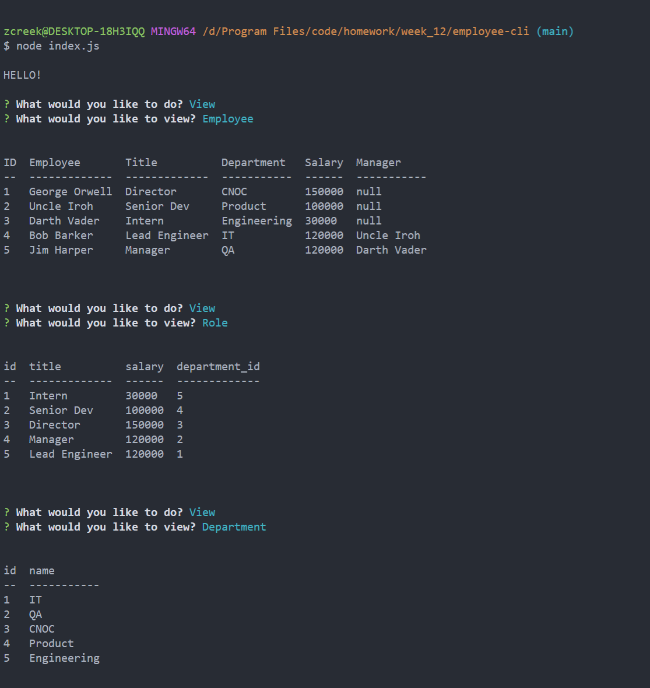

# Title
Employee CLI

# Description
Provides a command line interface for users to add,view,delete employees, roles and departments via CLI promted questions.

# Table of Contents
* [Title](#Title)
* [Description](#Description)
* [Installation](#Installation)
* [Usage](#Usage)
* [License](#License)
* [Questions](#Questions)

# Installation
npm i

# Usage
node index.js

# License
This work is licensed under the following:

# Questions

[Click Here to Visit my GitHub](https://github.com/vivid-green)

Email me with questions: zacharycreek@gmail.com
